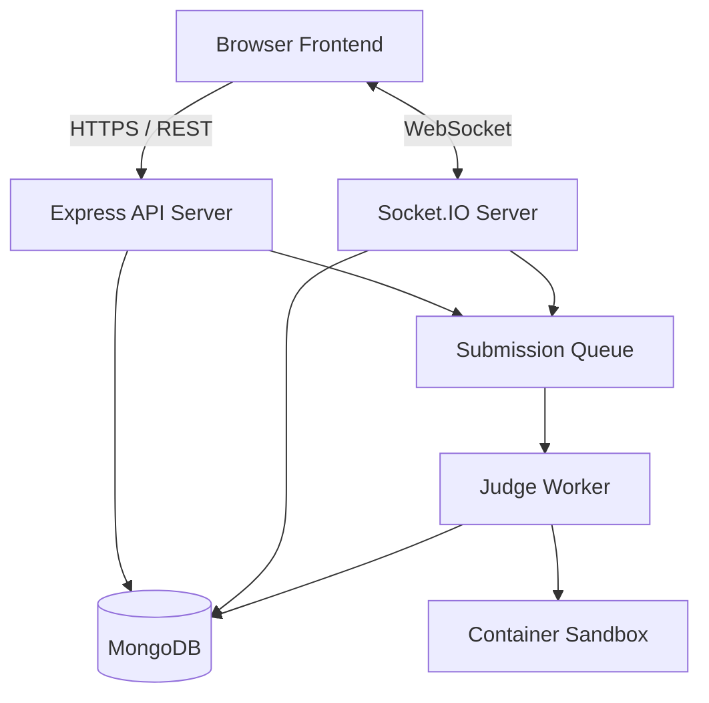

# Architecture Design

## 1. High-Level Architecture
The application follows a modern, decoupled full-stack architecture with a focus on real-time capabilities and secure code execution.

## 2. Technology Stack
- **Frontend:** React, Vite, JavaScript, JSX, Tailwind CSS, Monaco Editor.
- **Backend:** Node.js, Express, JavaScript, Socket.IO.
- **Database:** MongoDB via Mongoose.
- **Testing:** Vitest/Jest (Unit/Integration), Playwright (E2E).
- **No TypeScript:** Strictly modular modern JavaScript.

## 3. Major Service Boundaries
- **API Service:** Handles stateless requests (auth, profile CRUD, problem CRUD, history).
- **Matchmaking Service:** Pairs users based on rating and selected game mode, creates Battle instances.
- **Real-Time Battle Service (Socket.IO):** Manages active game state, timer authority, real-time scoring, submission status broadcasting.
- **Problem Selection Service:** Randomly and fairly selects problem sets based on game mode rules and user exposure history.
- **Execution / Judge Service:** Securely compiles and executes untrusted user code against test cases in an isolated environment.
- **Rating Service:** Calculates post-match rating updates (Elo-style) and maintains history logs.

## 4. Database Models (MongoDB)
- **User:** Authentication info, global stats, ratings per mode.
- **ExternalProfile:** Linked profiles (LeetCode, Codeforces, etc.).
- **Friendship / FriendRequest:** Social graph.
- **Challenge:** Direct matchmaking requests.
- **Battle:** Match history, configuration, participant scores, resulting rating changes, problem set used.
- **Problem / ProblemVersion:** Problem content, test cases, supported languages.
- **Submission:** Execution results and code snapshots.
- **GameMode / TimeControl:** Configuration for different match types.
- **FairPlayEvent / Ban:** Moderation and telemetry logs.

## 5. Real-Time Design
- Socket.IO namespaces/rooms for presence, matchmaking, and active battles.
- The server is the absolute source of truth for the timer and the final score.
- Reconnection logic to handle temporary network drops gracefully.

## 6. Judge Design (Code Execution)
- Strict separation from the main Express server.
- The main API pushes execution jobs to a queue.
- Worker nodes pick up jobs and run them in restricted Docker/isolate sandboxes.
- The worker enforces limits: CPU time, Memory, File System, Network (disabled).

## 7. Deployment Strategy
- Separate containers/services for Web, API, and Judge Workers.
- WebSocket load balancing with sticky sessions.
- Scalable database cluster.
